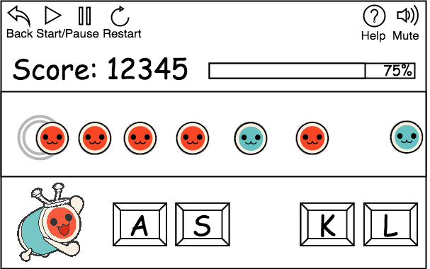
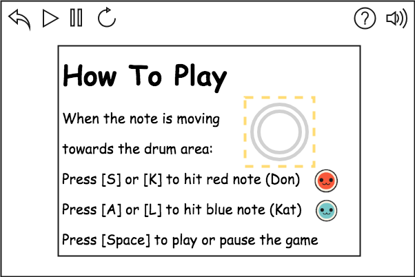

# Taiko

## Background and Overview

Taiko is a rhythm game featured a Japanese Taiko drum.

The player hits a drum in a stream of notes following a piece of music.

## MVP Features

In Taiko, player is able to:

- Choose two difficulty levels

- Hit the drum to play a music note

- View the progress and score

- Start, pause, restart the level

## Technologies

- Vanilla Javascript

- HTML5 Canvas/CSS

- Web Audio API

## Wireframes

## Implementation Timeline

__Over the weekend__

- [x] Finish proposal

- [x] Set up canvas

- [x] Register key events

__Day 1__

- [x] Read tutorials

- [x] Complete moving notes

- [x] Load sound effects and music

__Day 2__

- [x] Complete gameplay logic

__Day 3__

- [ ] Complete progress bar

- [ ] Complete score

__Day 4__

- [ ] Style canvas

- [ ] Create controls for game start, pause, restart

- [ ] Write how-to-play

## Bonus

- Allow players to customize the drum sounds

- Allow players to import their own music

- Allow two-player mode
